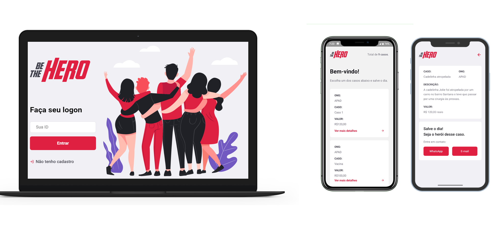

<h1 align="center">
    
</h1>

<h4 align="center">
   Semana OmniStack 11.0
</h4>

<p align="center">
  

  
  
  <a href="https://github.com/LeandroSantosGit/BeTheHero/commits/master">
    
  </a>

  <a href="https://github.com/LeandroSantosGit/BeTheHero/issues">
    
  </a>
  
</p>

<p align="center">
  <a href="#-Projeto">💻 Projeto</a>&nbsp;&nbsp;&nbsp;|&nbsp;&nbsp;&nbsp;
  <a href="#rocket-tecnologias"> :rocket: Tecnologias</a>&nbsp;&nbsp;&nbsp;|&nbsp;&nbsp;&nbsp;
  <a href="#-layout"> 🔖 Layout</a>&nbsp;&nbsp;&nbsp;|&nbsp;&nbsp;&nbsp;
  <a href="#gear-instalação"> :gear: Instalação</a>&nbsp;&nbsp;&nbsp;
  <a href="#-como-contribuir">🤔 Como Contribuir</a>&nbsp;&nbsp;&nbsp;|&nbsp;&nbsp;&nbsp;
  <a href="#tv-vídeos"> :tv: Vídeos</a>&nbsp;&nbsp;&nbsp;|&nbsp;&nbsp;&nbsp;
  <a href="#memo-licença"> :memo: Licença</a>
</p>

<p align="center">
  
</p>


## 💻 Projeto

O BeTheHero é um projeto que visa ajudar ONG's (Organizações não governamentais) a divulgar incidentes ocorridos, tendo com intuito conectar pessoas que desejam fazer contribuições monetárias. As ONGS podem cadastrar os incidentes ocorridos, informando valores e contatos por email e whatsapp, que ficam disponivel na aplicação mobile, de forma acessível e ágil. Este projeto foi desenvolvido na semana-omnistack-11 da [Rocketseat](https://rocketseat.com.br/).

Repositório oficial do projeto [semana-omnistack-11](https://github.com/Rocketseat/semana-omnistack-11).

## :rocket: Tecnologias

Esse projeto foi desenvolvido com as seguintes tecnologias:

- [Node.js](https://nodejs.org/en/)
- [React](https://reactjs.org)
- [React-Native](https://facebook.github.io/react-native/)
- [Expo](https://expo.io/)
- [Express](https://expressjs.com/pt-br/)
- [Axios](https://www.npmjs.com/package/axios)
- [Cors](https://github.com/expressjs/cors)
- [Nodemon](https://nodemon.io/)
- [knex](http://knexjs.org/)
- [jest](https://jestjs.io/)
- [Celebrate](https://github.com/arb/celebrate)

## 🔖 Layout

Você pode visualizar o layout do projeto no formato através [desse link](https://www.figma.com/file/2C2yvw7jsCOGmaNUDftX9n/Be-The-Hero---OmniStack-11?node-id=37%3A394). Lembrando que você irá precisar ter uma conta no [Figma](http://figma.com/).

## :gear: Instalação

Para executar a aplicação é necessário ter instalado as ferramentas a baixo:

* [Npm](https://www.npmjs.com/package/npm/v/6.13.4  "Clique para abrir a página de instalação") na versão `^6.13.4`

* [Node.js](https://nodejs.org/ru/download/releases/  "Clique para abrir a página de instalação") na versão `^12.16.1`

* [Expo-cli](https://docs.expo.io/versions/v36.0.0/get-started/installation/ "Clique para abrir a página de instalação") na versão `~36.16.1`

#### Backend

Abra o terminal e navegue até o diretório `backend`, e baixe as dependencias da aplicação executando os comados a baixo:
```
$npm install
```
Em seguida execute o servidor `Express` com o comando a baixo:
```
$npm start
```

A aplicação utiliza `SQLite` como bando de dados, as consultas foram construidas com [knex](http://knexjs.org/).

#### Web

Abra o terminal e navegue até o diretório `frontend`, e baixe as dependencias da aplicação executando os comados a baixo:
```
$npm install
```

Em seguida execute o `ReactJS` com o comando a baixo:
```
$npm start
```

Automaticamente será aberta aplicação web no seu navegador em `localhost:3333`.

#### Mobile

Abra o terminal e navegue até o diretório `mobile`, e baixe as dependencias da aplicação executando os comados a baixo:
```
$npm install
```

Em seguida execute o `expo` com o comando a baixo:
```
$npm start
```

Automaticamente será aberta no seu navegador a página `localhost:19002`. Conecte no emulador, ou teste o aplicativo por LAN: baixe o aplicativo Expo da Play Store ou App Store e em seguida escaneie o código QR. Está aplicação foi executado em um dispositivo Android Versão 6.0.1.

Abra a diretório `src/services` e coloque o endereço do seu servidor, no arquivo `api.js` altere a `baseURL` com o número IPV4 da sua conexão com a porta 3333. Exemplo:
```
const api = axios.create({
	baseURL:  "http://192.168.0.134:3333",
});
```

## 🤔 Como contribuir

- Faça um fork desse repositório;
- Cria uma branch com a sua feature: `git checkout -b minha-feature`;
- Faça commit das suas alterações: `git commit -m 'feat: Minha nova feature'`;
- Faça push para a sua branch: `git push origin minha-feature`.

Depois que o merge da sua pull request for feito, você pode deletar a sua branch.

## :tv: Vídeos

O canal do Filipe Deschamps no Youtube lançou vídeos durante a semana resumindo em detalhes tudo que rolou na Semana OminStack 10 [Playlist](https://www.youtube.com/playlist?list=PLMdYygf53DP4QMK3-NG5yvD62nCuO5wA_)

## :memo: Licença

Esse projeto está sob a licença MIT. Veja o arquivo [LICENSE](LICENSE.md) para mais detalhes.